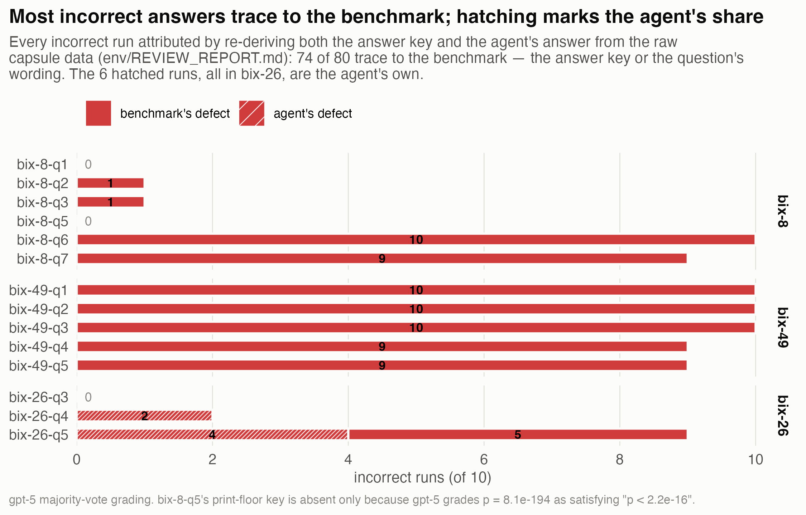
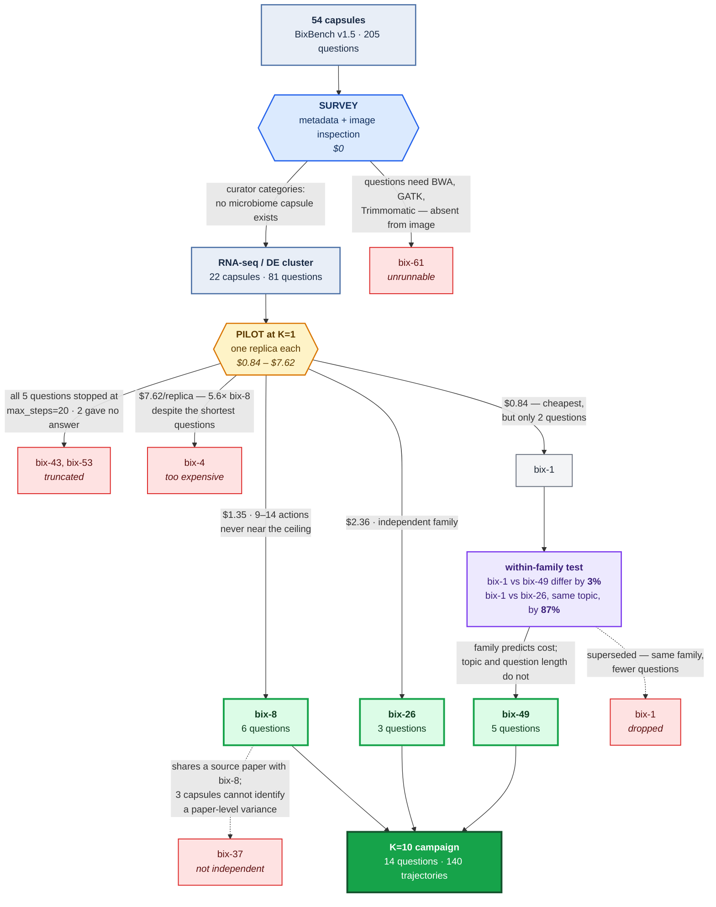

# What the score hides: an audit of BixBench

BixBench is FutureHouse's benchmark for bioinformatics agents. It does
something right that most benchmarks skip — it runs every analysis ten times —
but those runs are pooled into a single accuracy number, and everything the
pooling flattens goes unexamined. This study audits what that score hides, on
three capsules (14 questions, 140 agent runs, ~$80): the run-to-run variation,
the grader's reliability, and the answer keys themselves. The headline:
**most of what the benchmark scores as agent failure does not come from the
agent.** 73 of 80 incorrect answers trace to the answer key or the question's
wording — verified by re-deriving both the key and the agent's answer from the
raw data — and 9 of the 10 runs that never answered died following the
harness's own package-install instruction. The agent's own share is 8 runs out
of 140.

**The full writeup is [writeup.md](writeup.md).** Four findings, one per
figure:

1. **[Grader disagreement follows model generation, not model family](writeup.md#the-grader-is-part-of-the-instrument)**
   — two current-generation graders from different families agree on all 130
   answers; the shipped previous-generation grader contradicts itself on 14.6%
   of them.
2. **[No answer is its own outcome, not a wrong answer](writeup.md#no-answer-is-its-own-outcome-not-a-wrong-answer)**
   — 10 runs never answered; 9 died in the harness's own install instruction,
   1 ran out of steps.
3. **[Correctness is a property of the question, not luck](writeup.md#correctness-is-a-property-of-the-question)**
   — per-question success rates are bimodal: near-certain success or
   near-certain failure, almost nothing between.
4. **[Most incorrect answers trace to the benchmark](writeup.md#where-the-failures-actually-come-from)**
   — hidden analysis choices in the key, genes-versus-transcripts conflation,
   and keys that contradict their own questions' thresholds.

## Where to read

| Document | What it holds |
|---|---|
| [writeup.md](writeup.md) | The study, finding-first (~1,700 words, 4 figures) |
| [Interactive run audit](results/figures/fig4_interactive.html) | All 140 runs; hover any run for its verified cause |
| [env/REVIEW_REPORT.md](env/REVIEW_REPORT.md) | Case-by-case failure attribution, verified by recomputation |
| [env/SETUP.md](env/SETUP.md) · [env/DESIGN.md](env/DESIGN.md) · [env/PAPER_NOTES.md](env/PAPER_NOTES.md) · [env/CAPSULE_SELECTION.md](env/CAPSULE_SELECTION.md) | Environment and friction log · grader design · what the paper says, verified · capsule choice |
| [Agent trajectories on Zenodo](https://doi.org/10.5281/zenodo.22151974) | All 159 runs with full notebooks (~216 MB), deposited as a dataset |

## Choosing the capsules

Three capsules out of 54. The diagram's argument
is **which filters were free and which had to be paid for**.

Two eliminations cost nothing — the curators' own `categories` field shows no
microbiome capsule exists, and listing the Docker image shows `bix-61` needs BWA,
GATK and Trimmomatic that are not installed. Everything below the amber box
required spending money, and **none of it was predictable**: `bix-4` had the
shortest questions of any candidate, was forecast cheapest, and cost 5.6× `bix-8`.

One rule survived. Capsules from the same source paper cost within **3%** of each
other per rollout; capsules sharing a *topic* but not a paper differ by **87%**.
So one pilot generalizes across a family, and neither topic nor question length
predicts anything. Full reasoning in
[`env/CAPSULE_SELECTION.md`](env/CAPSULE_SELECTION.md).

## Scope, stated up front

Small N: 3 capsules of 54, 14 questions, one agent configuration, one pinned model
at temperature 1.0. This is a structured probe, not a replication of the BixBench
leaderboard. It cannot speak to self-preference (one answering model),
cross-model comparison, temperature dependence, or the benchmark as a whole.

## Layout

| Path | What lives here |
|---|---|
| [writeup.md](writeup.md) | The study writeup |
| `env/` | Setup and friction log, design notes, capsule selection, paper notes, the review report |
| `py/` | Capsule survey, replicate-run pipeline, grading, verification scripts |
| `R/` | Two-stage `brms` model, figures, key-verification scripts |
| `results/` | Tidy CSVs, the spend ledger, model summary, and the four figures |
| [references.bib](references.bib) | Verified references for the writeup |
| `scripts/` | Campaign runner and run watcher |
| `notebooks/` | Curated agent notebooks quoted in the failure taxonomy |
| `data/` | Capsule data (gitignored; pulled from Hugging Face) |

## Upstream

- Paper: [arXiv:2503.00096](https://arxiv.org/abs/2503.00096) — *BixBench: a Comprehensive Benchmark for LLM-based Agents in Computational Biology* (17% open-answer accuracy; no better than random on MCQ)
- Harness: [Future-House/BixBench](https://github.com/Future-House/BixBench)
- Agent: [Future-House/data-analysis-crow](https://github.com/Future-House/data-analysis-crow)
- Dataset: [futurehouse/BixBench](https://huggingface.co/datasets/futurehouse/BixBench) — public, despite the README's login step

## License

MIT — see [LICENSE](LICENSE).
