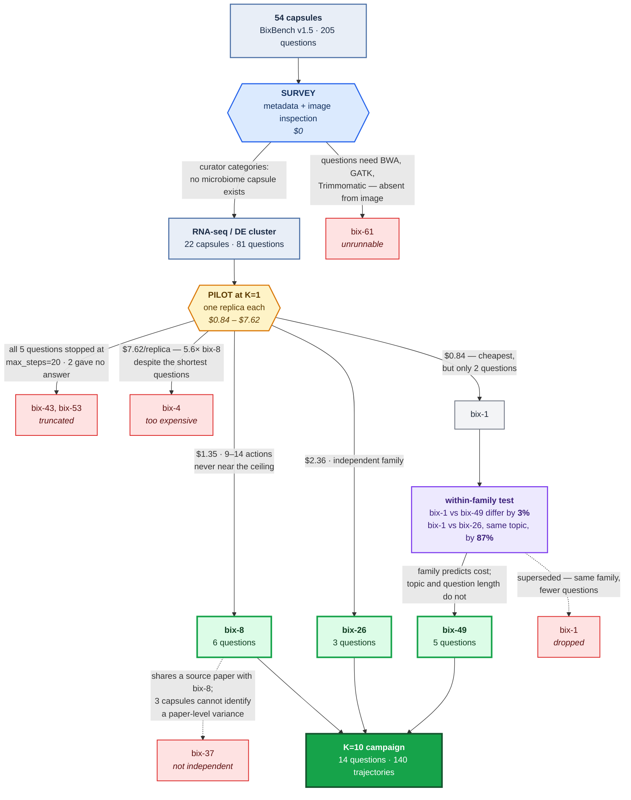

# BixBench Reliability Study

**Status: replicate campaign running.** Two of three capsules complete. Findings
below are preliminary and will be restated with credible intervals once the
`brms` analysis runs.

## The question

BixBench reports how often LLM agents get bioinformatics analyses right. It does
not report whether those numbers are **stable**, or what the failures actually
are **biologically**.

One correction to the premise, from reading the paper rather than assuming: the
authors *do* replicate, ten times per question, "to account for stochastic
trajectories". They then pool those runs into a single accuracy fraction and
report no standard deviation, no interval, and no measure of how often the agent
answers the same question differently. **The variance was generated and
discarded.** That is what this study recovers.

## Findings so far

**Roughly 1 in 4 replicate pairs disagree, and the two capsules measured are
unstable in different ways.** Agreement between ten runs of the same question, at
temperature 1.0 — the setting every shipped BixBench config uses:

| Capsule | exact | within 1% | within 5% |
|---|---:|---:|---:|
| `bix-8` | 76.3% | 90.0% | **90.0%** |
| `bix-49` | 69.6% | 92.3% | **100%** |

`bix-49`'s disagreements are numerical drift that vanishes at 5% tolerance.
`bix-8`'s survive it — 321 versus 901 on one question, 70 versus 106 on another,
where 106 is correct. **Self-consistency is therefore not one number**: a single
agreement rate would hide that one capsule produces *different answers* while the
other produces *the same answer computed slightly differently*.

Because every ground truth in these capsules is numeric, agreement is computed by
parsing numbers directly from the answers, with **no LLM grader in the loop**.

**71.4% of what BixBench scores as an incorrect answer is the model declining to
answer.** Across both shipped zero-shot baselines, 284 of 398 answers marked wrong
were graded `refused` by the grader itself. `_parse_grade_response` maps every
verdict other than `correct` to incorrect, leaving `GradeType.REFUSED` unused.
(Zero-shot baselines have no data access, where refusing is appropriate — so this
sizes the mechanism, not the paper's agentic figure.)

**Four harness defects, all found by running it.** Refusals scored as wrong
answers; `evaluation_mode` naming two verifiers as if deterministic while ~100% of
open answers reach an LLM; a declared Python floor of 3.12 on which the agentic
path cannot run; and overlapping batches that re-run questions and let a repeat
resume from the previous attempt's notebook. Details in
[`env/SETUP.md`](env/SETUP.md).

## Choosing the capsules

Three capsules out of 54, and most of the project's effort. The diagram's argument
is **which filters were free and which had to be paid for**.

Two eliminations cost nothing — the curators' own `categories` field shows no
microbiome capsule exists, and listing the Docker image shows `bix-61` needs BWA,
GATK and Trimmomatic that are not installed. Everything below the amber box
required spending money, and **none of it was predictable**: `bix-4` had the
shortest questions of any candidate, was forecast cheapest, and cost 5.6× `bix-8`.

One rule survived. Capsules from the same source paper cost within **3%** of each
other per rollout; capsules sharing a *topic* but not a paper differ by **87%**.
So one pilot generalizes across a family, and neither topic nor question length
predicts anything. Full reasoning in
[`env/CAPSULE_SELECTION.md`](env/CAPSULE_SELECTION.md).

## Scope, stated up front

Small N: 3 capsules of 54, 14 questions, one agent configuration, one pinned model
at temperature 1.0. This is a structured probe, not a replication of the BixBench
leaderboard. It cannot speak to self-preference (one answering model),
cross-model comparison, temperature dependence, or the benchmark as a whole.

## Layout

| Path | What lives here |
|---|---|
| `env/` | Setup and friction log, design notes, capsule selection, paper notes |
| `py/` | Capsule survey, replicate-run pipeline, grading and consistency analysis |
| `R/` | `brms` multilevel analysis |
| `results/` | Tidy CSVs — the durable artifacts, including the spend ledger |
| `scripts/` | Campaign runner and run watcher |
| `notebooks/` | Curated agent notebooks quoted in the failure taxonomy |
| `data/` | Capsule data (gitignored; pulled from Hugging Face) |

## Upstream

- Paper: [arXiv:2503.00096](https://arxiv.org/abs/2503.00096) — *BixBench: a Comprehensive Benchmark for LLM-based Agents in Computational Biology* (17% open-answer accuracy; no better than random on MCQ)
- Harness: [Future-House/BixBench](https://github.com/Future-House/BixBench)
- Agent: [Future-House/data-analysis-crow](https://github.com/Future-House/data-analysis-crow)
- Dataset: [futurehouse/BixBench](https://huggingface.co/datasets/futurehouse/BixBench) — public, despite the README's login step

## License

MIT — see [LICENSE](LICENSE).
