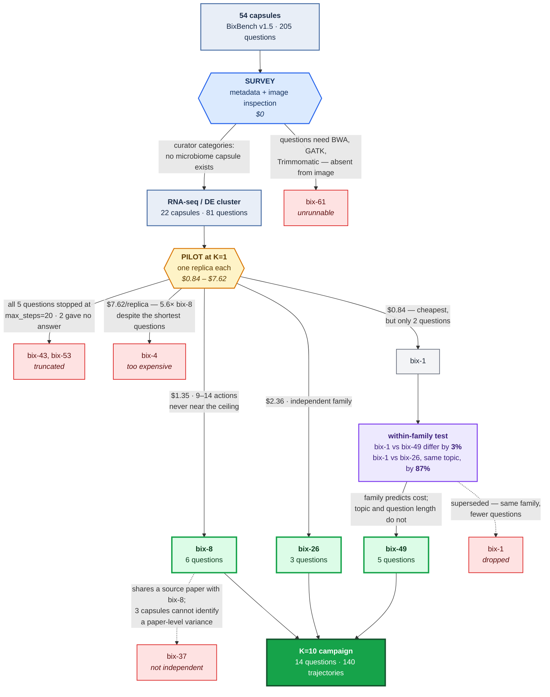

# How three capsules were chosen out of 54

The point of this diagram is not the shortlist. It is **which filters were free and
which had to be paid for**. Two of the five elimination criteria were discoverable
by reading metadata and inspecting the Docker image, at no cost. The other three
only became visible after spending money on a run — and one of them killed a
prediction rule that had looked sound.

**Colors carry meaning:** blue is a free survey step, amber is a step that cost
money, purple is the measurement that produced a usable rule, green is selected,
red is eliminated, and each arrow says *why*.

## What the diagram is arguing

**Only two eliminations were free.** The absent microbiome capsules came from the
curators' own `categories` field, and bix-61's missing toolchain came from listing
what the Docker image actually contains. Everything below the amber box required
running the agent.

**The expensive filters could not have been predicted.** bix-4 had the *shortest*
questions of any candidate and was forecast to be the cheapest; it cost 5.6× bix-8.
Truncation on bix-43 and bix-53 was likewise invisible until the runs stopped dead
at exactly 20 actions.

**One rule did survive.** bix-1 and bix-49 come from the same source paper and
differ by 3% per rollout; bix-1 and bix-26 share a topic but different papers and
differ by 87%. So one pilot per *family* generalizes to its siblings, while topic
and question length do not. That is the only reusable planning tool the exercise
produced, and it cost about $20 to find.

**bix-37 was rejected for a statistical reason, not an empirical one.** It shares a
source paper with bix-8, and with three capsules there is no way to identify a
paper-level variance component — the dependence would have to be assumed away
rather than modelled.

## Regenerating

The diagram is Mermaid source in this file; GitHub renders it directly. To export
an image, paste the fenced block into <https://mermaid.live>. The underlying
numbers come from `results/capsule_pilot_log.csv`, regenerated with
`python py/pilot_table.py`.
