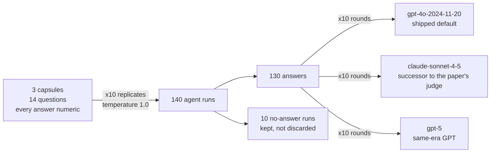

# What BixBench's discarded variance says — a reliability study

*Draft. Target 1,200–1,800 words. Sections follow the plan in HANDOFF.md;
references live in `references.bib`, every entry verified against arXiv.*

## The finding

*(to write — the three-sentence lead: the dispersion was generated and never
reported; most scored failure traces to the benchmark; the fixes are small.
State the base immediately: 3 capsules, 14 questions, 140 trajectories, one
model, $80.)*

## Why this benchmark, why this question

Agents are already doing bioinformatics. You can hand one a count matrix and a
question and get a full differential-expression analysis back in minutes — this
is happening now, and it is speeding the field up in a way nothing before it
did. Whether we can trust that work comes down to evaluation. And benchmarks
for biology agents are young: a small number exist, all from the last two years
— [LAB-Bench](https://arxiv.org/abs/2407.10362) and its February 2026 successor
[LABBench2](https://arxiv.org/abs/2604.09554) for research tasks,
[ScienceAgentBench](https://arxiv.org/abs/2410.05080) for data-driven analysis
across four disciplines — and the methods for checking the benchmarks
themselves — is the grader consistent, is the answer key right, is one accuracy
number enough — are younger still.

[BixBench](https://arxiv.org/abs/2503.00096), FutureHouse's benchmark for
bioinformatics agents, does something right that most benchmarks skip: it runs
every analysis ten times, because agents don't give the same answer twice. But
those ten runs get folded into a single accuracy fraction, and the spread — how
often the agent disagrees with itself — is never reported. I've spent seven
years doing statistics on messy clinical data, where the spread usually *is*
the story. So that's the question I went after: what does the discarded
variance say?

## What I ran

A BixBench capsule is a folder of real data from one published study, plus a
few open-ended questions an analyst should be able to answer from that data. I
picked three capsules — enough to see variation between capsules while keeping
the budget under control — through a deliberate selection process: survey all
54, pilot seven, keep three (the full workflow, with reasons for every
rejection, is [in the repo](env/CAPSULE_SELECTION.md)). The three come from
three different source papers, so they are independent of each other. Together
they carry 14 questions, and every answer is a number — a count, a ratio, a
p-value.

I ran each question 10 times at temperature 1.0 — the benchmark's own settings
— for 140 runs total.

| Capsule | Questions | Runs | Answered |
|---|---:|---:|---:|
| `bix-8` | 6 | 60 | 60 |
| `bix-49` | 5 | 50 | 48 |
| `bix-26` | 3 | 30 | 22 |

Grading was its own replicated experiment. The paper names Claude 3.5 Sonnet
as its judge, but that model (`claude-3-5-sonnet-20241022`) was retired in
October 2025, so it can no longer be called. I graded with a newer model from
the same Sonnet line (`claude-sonnet-4-5-20250929`) — and, to keep the OpenAI
side comparable, with a GPT model from around the same time
(`gpt-5-2025-08-07`), alongside the default the code actually ships
(`gpt-4o-2024-11-20`). Each grader scored every answer 10 times — so grader
noise is measured rather than assumed — and the majority of those 10 verdicts
decides: an answer counts as correct under a grader only when most of its 10
calls say so. That way one flaky grading call can't flip a result.

## The grader is part of the instrument

Before trusting any correct/incorrect label, I checked the graders themselves
— how reliable each one is, and whether they agree with each other. The result
is about what you'd expect: grader disagreement follows model generation, not
model family. gpt-5 and claude-sonnet-4-5 — different families, same
generation — hand down the same majority verdict on all 130 answers (the
nested rings in Figure 1). gpt-4o — BixBench's default grader, one generation
behind its own family-mate — contradicts itself on 14.6% of answers: shown the
same answer ten times, its ten verdicts come back mixed. And its majority
verdicts disagree systematically with the two current graders on two whole
questions (the labeled rows in Figure 1).

Not a surprising result, but a consequential one: every number downstream
depends on which grader reads the answers. I use gpt-5 for the rest of this
writeup.

## An agent run has three outcomes, not two

A run can end three ways: a correct answer, a wrong answer, or no answer at
all. BixBench only scores correct/incorrect, so the no-answer runs — 10 of my
140, the gray bars in Figure 2 — get counted as wrong answers. That default
deserves a closer look, because a no-answer run is not necessarily the agent's
mistake — you can't tell whose problem it is from the score alone. So I read
all ten trajectories. Only one was the agent's own doing: it ran out of its
40-step budget. The other nine died the same way — the harness's own prompt
tells the agent to install R packages through BiocManager, but the execution
image doesn't ship BiocManager, so runs that followed the instruction died
mid-install before any analysis began. The comparison across all 140 runs
backs this up: runs that attempted a package install failed to answer 19.6% of
the time (9 of 46), while the 93 runs that never attempted one all answered.
Folding all ten into "incorrect" inflates the agent's error rate with failures
that trace to the benchmark's own instructions.

## Where the failures actually come from

*(to write — fig 3: incorrect and no-answer runs split by verified cause,
warm = benchmark-attributable, cool = agent-attributable; one concrete example,
link REVIEW_REPORT.md.)*

## Correctness is a property of the question

*(to write — fig 4: the two-stage model, bimodal per-question rates, what
partial pooling buys; bridge to the taxonomy.)*

## Limitations and what I'd do next

*(to write — small N stated plainly; one agent configuration; graders are
themselves LLMs, and the Claude grader is the same model that produced the
answers, mirroring the benchmark's own agentic self-grading path; the remedy
for the benchmark's grader noise is a one-line grader-config change; next
steps.)*

## References

- Mitchener L, Laurent JM, Andonian A, et al. **BixBench: a Comprehensive
  Benchmark for LLM-based Agents in Computational Biology.** arXiv, 2025.
  [arXiv:2503.00096](https://arxiv.org/abs/2503.00096).
  doi:[10.48550/arXiv.2503.00096](https://doi.org/10.48550/arXiv.2503.00096)
- Laurent JM, Janizek JD, Ruzo M, et al. **LAB-Bench: Measuring Capabilities of
  Language Models for Biology Research.** arXiv, 2024.
  [arXiv:2407.10362](https://arxiv.org/abs/2407.10362)
- Laurent JM, Bou A, Pieler M, et al. **LABBench2: An Improved Benchmark for AI
  Systems Performing Biology Research.** arXiv, 2026.
  [arXiv:2604.09554](https://arxiv.org/abs/2604.09554)
- Chen Z, et al. **ScienceAgentBench: Toward Rigorous Assessment of Language
  Agents for Data-Driven Scientific Discovery.** ICLR 2025.
  [arXiv:2410.05080](https://arxiv.org/abs/2410.05080)
