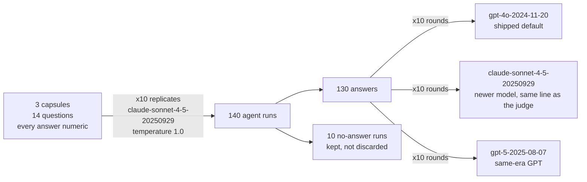

# What BixBench's discarded variance says — a reliability study

*Draft. Target 1,200–1,800 words. Sections follow the plan in HANDOFF.md;
references live in `references.bib`, every entry verified against arXiv.*

## The finding

I ran BixBench — FutureHouse's benchmark for bioinformatics agents — under
its own replication scheme, ten runs per question at temperature 1.0, and
audited everything the score usually hides. That score is a single number:
the share of runs a grader marks correct, pooled across replicates. Behind it
sit three things the pooling flattens: whether the agent answers the same
question the same way twice, whether the grader is reliable, and whether the
answer key is right. On the three capsules I
studied (14 questions, 140 agent runs, ~$80 of API spend), most of what the
benchmark scores as agent failure does not come from the agent: 73 of 80
incorrect answers trace to the answer key or the question's wording, verified
by re-deriving both the key and the agent's answer from the raw data, and 9
of the 10 runs that never answered died following the harness's own
package-install instruction. The agent's own share is 8 runs out of 140. None
of the fixes require new data — clearer wording, verified keys, a three-state
score — and the audit itself is reusable: the same checks would work on any
benchmark built like this one.

## Why this benchmark, why this question

Agents are already doing bioinformatics. You can hand one a count matrix and a
question and get a full differential-expression analysis back in minutes — this
is happening now, and it is speeding the field up in a way nothing before it
did. Whether we can trust that work comes down to evaluation. And benchmarks
for biology agents are young: a small number exist, all from the last two years
— [LAB-Bench](https://arxiv.org/abs/2407.10362) and its February 2026 successor
[LABBench2](https://arxiv.org/abs/2604.09554) for research tasks,
[ScienceAgentBench](https://arxiv.org/abs/2410.05080) for data-driven analysis
across four disciplines — and the methods for checking the benchmarks
themselves — is the grader consistent, is the answer key right, is one accuracy
number enough — are younger still.

[BixBench](https://arxiv.org/abs/2503.00096), FutureHouse's benchmark for
bioinformatics agents, does something right that most benchmarks skip: it runs
every analysis ten times, because agents don't give the same answer twice. But
those ten runs get folded into a single accuracy fraction, and the spread — how
often the agent disagrees with itself — is never reported. I've spent seven
years doing statistics on messy clinical data, where variation is often the
story: two treatments with the same average can behave very differently
patient to patient, and no average generalizes until you know the variation
around it. So that's the question I went after: what does the discarded
variance say?

## What I ran

A BixBench capsule is a folder of real data from one published study, plus a
few open-ended questions an analyst should be able to answer from that data. I
picked three capsules — enough to see variation between capsules while keeping
the budget under control — through a deliberate selection process: survey all
54, pilot seven, keep three (the full workflow, with reasons for every
rejection, is [in the repo](env/CAPSULE_SELECTION.md)). The three come from
three different source papers, so they are independent of each other. Together
they carry 14 questions, and every answer is a number — a count, a ratio, a
p-value.

I ran each question 10 times with
[Claude Sonnet 4.5](https://www.anthropic.com/news/claude-sonnet-4-5) as the
agent, at temperature 1.0 — the benchmark's own setting — for 140 runs total.

| Capsule | Questions | Runs | Answered | Topic | Source |
|---|---:|---:|---:|---|---|
| `bix-8` | 6 | 60 | 60 | Bladder-cancer m6A epigenomics | [paper](https://doi.org/10.1016/j.canlet.2024.217002) · [data](https://doi.org/10.17632/dj4sb8h3c3.1) |
| `bix-49` | 5 | 50 | 48 | Bohring-Opitz syndrome multiomics | [paper](https://doi.org/10.1172/jci.insight.167744) |
| `bix-26` | 3 | 30 | 22 | *P. aeruginosa* quorum sensing | [paper](https://doi.org/10.17912/micropub.biology.001326) |

Grading was its own replicated experiment. The paper names
[Claude 3.5 Sonnet](https://platform.claude.com/docs/en/about-claude/model-deprecations)
as its judge, but that model was retired in October 2025, so it can no longer
be called. I graded with a newer model from the same Sonnet line
([Claude Sonnet 4.5](https://www.anthropic.com/news/claude-sonnet-4-5)) — and,
to keep the OpenAI side comparable, with a GPT model from around the same time
([GPT-5](https://developers.openai.com/api/docs/models/gpt-5)), alongside the
default the code actually ships
([GPT-4o](https://developers.openai.com/api/docs/models/gpt-4o)). The exact
pinned versions are in the diagram below. Each grader scored every answer 10 times — so grader
noise is measured rather than assumed — and the majority of those 10 verdicts
decides: an answer counts as correct under a grader only when most of its 10
calls say so. That way one flaky grading call can't flip a result.

## The grader is part of the instrument

Before trusting any correct/incorrect label, I checked the graders themselves
— how reliable each one is, and whether they agree with each other. The result
is about what you'd expect: grader disagreement follows model generation, not
model family. gpt-5 and claude-sonnet-4-5 — different families, same
generation — hand down the same majority verdict on all 130 answers (the
nested rings in Figure 1). gpt-4o — BixBench's default grader, one generation
behind its own family-mate — contradicts itself on 14.6% of answers: shown the
same answer ten times, its ten verdicts come back mixed. And its majority
verdicts disagree systematically with the two current graders on two whole
questions (the labeled rows in Figure 1).

Not a surprising result, but a consequential one: every number downstream
depends on which grader reads the answers. I use gpt-5 for the rest of this
writeup.

## No answer is its own outcome, not a wrong answer

A run can end three ways: a correct answer, a wrong answer, or no answer at
all. BixBench only scores correct/incorrect, so the no-answer runs — 10 of my
140, the gray bars in Figure 2 — get counted as wrong answers. That default
deserves a closer look, because a no-answer run is not necessarily the agent's
mistake — you can't tell whose problem it is from the score alone. So I read
all ten trajectories. Only one was the agent's own doing: it ran out of its
40-step budget. The other nine died the same way — the harness's own prompt
tells the agent to install R packages through BiocManager, but the execution
image doesn't ship BiocManager, so runs that followed the instruction died
mid-install before any analysis began. The comparison across all 140 runs
backs this up: runs that attempted a package install failed to answer 19.6% of
the time (9 of 46), while the 93 runs that never attempted one all answered.
Folding all ten into "incorrect" inflates the agent's error rate with failures
that trace to the benchmark's own instructions.

## Correctness is a property of the question

For the answered runs, I fit a Bayesian multilevel model,
`correct ~ 1 + (1 | capsule/question)`, with gpt-5's verdicts as the outcome:
each question gets its own estimated probability of a correct answer,
questions are grouped inside their capsules, and a question with only a few
usable runs borrows information from its neighbors rather than being taken at
face value.

Figure 3 shows the result, and it is a split. The 14 questions fall into two
clumps — near-certain success or near-certain failure — with almost nothing
in between. All 5 bix-49 questions were graded incorrect on essentially every
run; 4 of the 6 bix-8 questions were graded correct on essentially every run.
Given an answer, correctness is a property of the question, not luck. So the
real question is what it is about these questions — which is where the error
taxonomy comes in.

## Where the failures actually come from

To find out, I re-derived every incorrect answer — the answer key and the
agent's number both — from the raw capsule data, inside the benchmark's own
Docker image. The full case-by-case table is in the repo
([REVIEW_REPORT.md](env/REVIEW_REPORT.md)); Figure 4 shows the totals, and an
[interactive companion](results/figures/fig4_interactive.html) lets you hover
any of the 140 runs for its verified cause and classification.

A few incorrect answers are the agent's own. In four bix-26-q5 runs the agent
misread gene-level DESeq2 output files as pathway tables and reported a row
count without ever running enrichment — the columns are unmistakably
gene-level, and six of its ten sibling runs read them correctly. A fifth run
on the same question invented a pathway-level fold-change metric to satisfy
the question's wording; the question does ask for a metric that standard
enrichment analysis cannot supply, but the right response is to say so, not
to fabricate one. And in two bix-26-q4 runs the agent simply landed on
different numbers where five of seven sibling runs reproduced the key
exactly. That is the agent's full share: seven runs, the hatched segments in
Figure 4.

The other 73 incorrect runs trace back to the benchmark, in three recurring
ways — each one the kind of thing that slips into any hand-built analysis,
and each one fixable:

- **The key quietly does an analysis the question never states.** All 47
  incorrect bix-49 runs come down to one line: the author's model adjusts for
  sex, but no question mentions sex. Adjusting was a perfectly reasonable
  choice — the question just never passes it on, so the agent's unadjusted
  numbers are exact answers to the question as written.
- **The question asks at one level; the key answers at another.** bix-8's
  questions ask about genes, but the key counts transcript rows (20 runs).
  The agent deduplicated transcripts to genes — arguably the more careful
  reading of the question — and was graded incorrect for it.
- **The key contradicts the question's own thresholds.** bix-26-q5 states an
  adjusted-p cutoff that the author's notebook never applies; the key was
  read off a plot rather than computed.

A smaller set comes from questions that are unclear or ill-defined:
bix-8-q2 could preclude a defensible 2×2 collapse by adding one phrase ("use
all levels"), and one bix-26-q5 run took a defensible alternative route
(GSEA) around the impossible pathway-significance definition described above.
None of this requires new data to fix; it is question wording and key
derivation, the cheapest parts of a benchmark to improve.

## Limitations and what I'd do next

This is a small study by design. The agent-run budget bought three carefully
chosen capsules — 14 questions from three source papers — so the findings
describe those capsules, not BixBench as a whole. The specific failure causes
are concentrated too: the gene-versus-transcript cases all come from one
capsule. What travels beyond these three capsules is the audit itself, not
the numbers: replicate the runs and keep the spread, measure the grader
before trusting it, score no-answer as its own outcome and trace its cause,
re-derive the key before it referees anything — and run this whole check end
to end, down to reading the agent's trajectories, before a benchmark ships.

One agent model ran everything, and my Claude grader is the same model that
produced the answers — mirroring the benchmark's own agentic setup, where
each model grades itself. If that breeds leniency toward its own answers,
this design can't detect it. The clean test is straightforward: run gpt-5 as
the agent too, have both families grade both answer sets, and model the
grader-by-answerer interaction. Likewise, everything ran at temperature 1.0
because that is what the benchmark ships; how the instability behaves at
other temperatures is untested and worth knowing.

The graders here had an easy job — every answer is a number. On questions
with free-text or multi-part answers, an LLM verdict deserves less trust, and
spot-checking by human graders would be worth the cost. And the deepest
lesson cuts at the ground truth itself: an answer key derived from one
author's notebook needs the same verification the agent gets — re-derived
from the raw data, ideally with an independent model in the loop — before it
referees anything.

If I extended the benchmark itself, I'd start with the field it doesn't
cover:
BixBench has no microbiome or metagenomics capsules at all — confirmed three
independent ways — and that is the corner of biology I know best.

*Analysis, verification scripts, and figures were built with Claude Code as
an assistant; every recomputation is a committed script (`R/verify_*.R`,
`py/verify_*.py`) that reproduces the numbers independently of who typed it,
and all classification rulings are mine.*

## References

- Mitchener L, Laurent JM, Andonian A, et al. **BixBench: a Comprehensive
  Benchmark for LLM-based Agents in Computational Biology.** arXiv, 2025.
  [arXiv:2503.00096](https://arxiv.org/abs/2503.00096).
  doi:[10.48550/arXiv.2503.00096](https://doi.org/10.48550/arXiv.2503.00096)
- Laurent JM, Janizek JD, Ruzo M, et al. **LAB-Bench: Measuring Capabilities of
  Language Models for Biology Research.** arXiv, 2024.
  [arXiv:2407.10362](https://arxiv.org/abs/2407.10362)
- Laurent JM, Bou A, Pieler M, et al. **LABBench2: An Improved Benchmark for AI
  Systems Performing Biology Research.** arXiv, 2026.
  [arXiv:2604.09554](https://arxiv.org/abs/2604.09554)
- Chen Z, et al. **ScienceAgentBench: Toward Rigorous Assessment of Language
  Agents for Data-Driven Scientific Discovery.** ICLR 2025.
  [arXiv:2410.05080](https://arxiv.org/abs/2410.05080)

Capsule source papers:

- Shen C, Liu J, Xie F, et al. **N6-Methyladenosine enhances the translation
  of ENO1 to promote the progression of bladder cancer by inhibiting PCNA
  ubiquitination.** Cancer Letters 595:217002, 2024.
  doi:[10.1016/j.canlet.2024.217002](https://doi.org/10.1016/j.canlet.2024.217002)
  (bix-8; dataset doi:[10.17632/dj4sb8h3c3.1](https://doi.org/10.17632/dj4sb8h3c3.1))
- Lin I, Wei A, Awamleh Z, et al. **Multiomics of Bohring-Opitz syndrome
  truncating ASXL1 mutations identify canonical and noncanonical Wnt
  signaling dysregulation.** JCI Insight 8(10):e167744, 2023.
  doi:[10.1172/jci.insight.167744](https://doi.org/10.1172/jci.insight.167744)
  (bix-49)
- Abdul-Rahman F, Xavier J. **Reciprocal signaling between quorum sensing
  mutants: A model for division of labor.** microPublication Biology, 2024.
  doi:[10.17912/micropub.biology.001326](https://doi.org/10.17912/micropub.biology.001326)
  (bix-26)
